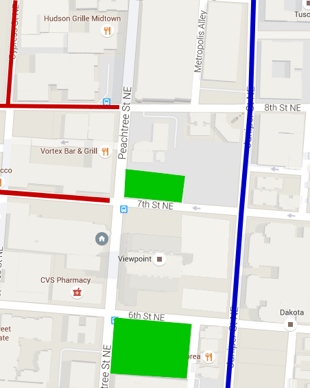

*102 Knob Hills Circle, Decatur, GA 30030*

The neighborhood is called Knob Hills and is located at the corner of Church
St and Forkner Dr. It is located between Decatur Square and the Decatur
Walmart.  You can enter the townhouse subdivision from either Church St or
Forkner Dr.

<iframe
src="https://www.google.com/maps/embed?pb=!1m18!1m12!1m3!1d1658.008894130143!2d-84.29103340291813!3d33.78603880958942!2m3!1f0!2f0!3f0!3m2!1i1024!2i768!4f13.1!3m3!1m2!1s0x88f5076d3b944ed9%3A0x669ac86bde9fd128!2s102+Knob+Hills+Cir%2C+Decatur%2C+GA+30030!5e0!3m2!1sen!2sus!4v1517068907310"
width="100%" height="400" frameborder="0" style="border:0">&nbsp;</iframe>

For parking, the map below shows unit marked in the back corner of the
neighborhood. Orange indicates several places to park: two areas in our
subdivision, in front of the garage behind our unit, or along Forkner Drive on
the side of the street closest to our unit.

