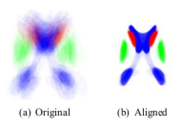

# Research Projects

Below are descriptions of various projects I pursued.  There is also a <a
href="index.html">list of publications</a> and <a
href="#downloads-for-matlab">software downloads</a> associated with this work.

## Filtered Neural Tractography

  
  
  
  
  
  
  
  
  
  
  
  

Many techniques for tracing out neural fiber pathways estimate the local fiber
orientation independently at each voxel, so there is no running knowledge of
confidence in the estimated model parameters.  In this work, we formulate
fiber tracking as recursive estimation: at each step of tracing the fiber, the
current estimate is guided by the previous.  Despite the presence of noise and
uncertainty, this provides a causal estimate of the local structure at each
point along the fiber.

To handle crossings and branchings of multiple fiber pathways, we model the
local signal as a mixture of tensors.  Starting from a seed point, each fiber
is traced to its termination using an unscented Kalman filter (UKF) to
simultaneously fit the local model and propagate in the most consistent
direction.  Within this filtering framework, path regularization is inherent
and estimation adapts to the level of noise present in the signal.

Synthetic experiments demonstrate that this approach significantly improves
the angular resolution at crossings and branchings.  <i>In vivo</i>
experiments confirm the ability to trace out fibers in areas known to contain
such crossing and branching.  Many of these known pathways were not revealed
with single-tensor tractography.

<a href="pdfs/malcolm_cukf.pdf">&#8220;Two-Tensor Tractography
Using a Constrained Filter&#8221;</a>, Malcolm, Shenton, Rathi, <i>Medical
Image Computing and Computer Assisted Intervention (MICCAI)</i>, pages
894-902, 2009. [<a href="pdfs/malcolm_cukf_poster.pdf">poster</a>, <a
 href="javascript:toggle('malcolm_cukf')">bib</a>]

<pre>
@conference{Malcolm2009miccai,
  author = "J. G. Malcolm and M. E. Shenton and Y. Rathi",
  title = "Two-Tensor Tractography Using a Constrained Filter",
  booktitle = "Medical Image Computing and Computer Assisted Intervention ({MICCAI})",
  pages = "894--902",
  year = 2009
}
</pre>

<a href="pdfs/malcolm_2t.pdf">&#8220;Neural Tractography Using An Unscented
Kalman Filter&#8221;</a>, Malcolm, Shenton and Rathi, <i>Information
Processing in Medical Imaging
(IPMI)</i>, 2009. [<a href="pdfs/malcolm_2t_slides.pdf">slides</a>]

<a href="pdfs/others/rathi_watson.pdf">&#8220;Mixture Model for estimating
fiber ODF and multi-directional Tractography&#8221;</a>, Rathi, Malcolm,
Bouix, Kindlmann, Westin, Kubicki, Shenton, <i>Intl. Soc. of Magnetic
Resonance in Medicine (ISMRM)</i>, 2009.
[<a href="pdfs/others/rathi_watson_slides.pdf">slides</a>]

## Label Space

Many techniques for multi-shape representation may often develop inaccuracies
stemming from either approximations or inherent variation.  Label space is an
implicit representation that offers unbiased algebraic manipulation and
natural expression of label uncertainty.  We demonstrate smoothing and
registration on multi-label brain MRI.

<a href="pdfs/malcolm_lss.pdf">&#8220;Label Space: A Coupled
Multi-Shape Representation&#8221;</a>, Malcolm, Rathi, Shenton, Tannenbaum,
<i>Medical Image Computing and Computer Assisted Intervention (MICCAI)</i>,
2008. <b>Runner-Up, MICCAI Young Scientist Award</b> [<a
 href="pdfs/malcolm_lss_slides.pdf">slides</a>]

<a href="pdfs/malcolm_ls.pdf">&#8220;Label Space: A
Multi-Object Shape Representation&#8221;</a>, Malcolm, Rathi, Tannenbaum,
<i>Combinatorial Image Analysis</i>, 2008.

<a href="pdfs/others/rathi_affine.pdf">&#8220;Affine
registration of label maps in Label Space&#8221;</a>, Rathi, Malcolm, Bouix,
Tannenbaum, Shenton, <i>J. of Computing</i>, 2(4), pages 1-11, 2010. [<a
 href="javascript:toggle('rathi_affine')">bib</a>]

<pre>
@article{Rathi2010affine,
  title = {Affine registration of label maps in {Label Space}},
  author = {Y. Rathi and J. Malcolm and S. Bouix and A. Tannenbaum and M. E. Shenton},
  journal = {J. of Computing},
  volume = 2,
  number = 4,
  pages = "1--11",
  year = 2010
}
</pre>

<a href="pdfs/others/rathi_segmenting_analytically.pdf">&#8220;Segmenting
Images Analytically in Shape Space&#8221;</a>, Rathi, et al., <i>IS&T/SPIE
Symposium on Medical Imaging</i>, 2008.

## Level set methods

  

In many situations the regional statistics of the object of interest are
unknown.  In such cases one approach is to separate an object from its
background measuring their statistical difference with the Bhattacharyya
metric. <a href="https://github.com/jgmalcolm/levelsets">Download the MATLAB
code</a> for these techniques.

Further, the numerical considerations of the level set method often prohibit
its use high performance applications which has driven our development of an
efficient and flexible algorithm for curve evolution.

<a href="pdfs/others/rathi_seeing_unseen.pdf">&#8220;Seeing
the Unseen: Segmenting with Distributions&#8221;</a>, Rathi, Michailovich,
Malcolm, Tannenbaum, <i>Intl. Conference on Signal and Image Processing
(SIP)</i>, 2006.

<a href="pdfs/malcolm_lsdm.pdf">&#8220;Fast Approximate
Surface Evolution in Arbitrary Dimension&#8221;</a>, Malcolm, Rathi, Yezzi,
Tannenbaum, <i>IS&T/SPIE Symposium on Medical Imaging</i>, 2008. [<a
 href="pdfs/malcolm_lsdt_slides.pdf">slides</a>, <a
 href="pdfs/malcolm_lsdm_poster.pdf">poster</a>]

<a href="pdfs/others/vela_closed.pdf">&#8220;Closed Loop
Visual Tracking Using Observer-Based Dynamic Active Contours&#8221;</a>,
Vela, Niethammer, Malcolm, Tannenbaum, <i>Conf. on Guidance, Navigation, and
Control</i>, 2005.

<a href="pdfs/others/vela_range.pdf">&#8220;Vision-Based
Range Regulation of a Leader-Follower Formation&#8221;</a>, Vela, Betser,
Malcolm, Tannenbaum, <i>IEEE Transactions on Control Systems Technology</i>,
17(2):442-448, 2009

<a href="pdfs/others/lankton_lsfb.pdf">&#8220;Localized
statistics for DW-MRI fiber bundle segmentation&#8221;</a>, Lankton,
Melonakos, Malcolm, Dambreville, Tannenbaum, <i>MMBIA</i>, 2007. [<a
 href="pdfs/others/lankton_lsfb_poster.pdf">poster</a>]

## Multi-object tracking with graph cuts

The standard graph cut technique quickly captures objects anywhere in the
image; however, because of its global nature, it is prone to capturing
outlying areas similar to the object of interest.  This work proposes a method
to constrain the standard graph cut technique to regions of interest for
tracking multiple interacting objects.  <a
href="https://github.com/jgmalcolm/graphchop">Download the MATLAB package</a>
for graph cut image segmentation (Win32, Mac, Linux32, Linux64).

<a href="pdfs/malcolm_dp.pdf">&#8220;Tracking Through Clutter Using Graph
Cuts&#8221;</a>, Malcolm, Rathi, Tannenbaum, <i>British Machine Vision
Conference
(BMVC)</i>, 2007. [<a href="pdfs/malcolm_dp_poster.pdf">poster</a>].

<a href="pdfs/malcolm_mdp.pdf">&#8220;Multi-Object Tracking Through Clutter
Using Graph Cuts&#8221;</a>, Malcolm, Rathi, Tannenbaum, <i>Workshop on
Non-rigid Registration and Tracking through Learning (in
ICCV)</i>, 2007. [<a href="pdfs/malcolm_mdp_slides.pdf">slides</a>].

<!---
#### Videos

Multi-object tracking [<a class="thickbox" href="#TB_inline?width=400&height=326&inlineId=gct_multi">watch</a>]
  
<embed src="http://www.youtube.com/v/91IOJYsB-Gc&autoplay=1" type="application/x-shockwave-flash" width="400" height="316"></embed>

  <li>Highly deforming objects [<a class="thickbox" href="#TB_inline?width=400&height=326&inlineId=gct_color">watch</a>]
  
<embed src="http://www.youtube.com/v/ubgNJ1rF_r0&autoplay=1" type="application/x-shockwave-flash" width="400" height="316"></embed>
</a>
  <li>Multiple interacting objects [<a class="thickbox" href="#TB_inline?width=400&height=326&inlineId=gct_bme">watch</a>]
  
<embed src="http://www.youtube.com/v/3nji-AQ63Xk&autoplay=1" type="application/x-shockwave-flash" width="400" height="316"></embed>
</a>
  <li>Kalman filtering to compensate for sever camera jitter [<a class="thickbox" href="#TB_inline?width=400&height=326&inlineId=gct_van">watch</a>]
  
<embed src="http://www.youtube.com/v/LCuZbgrahsQ&autoplay=1" type="application/x-shockwave-flash" width="400" height="316"></embed>
</a>
  <li>Failure without location prediction (assume object hasn't moved) [<a class="thickbox" href="#TB_inline?width=400&height=326&inlineId=gct_nopredict">watch</a>]
  
<embed src="http://www.youtube.com/v/NfaiU7wCYfw&autoplay=1" type="application/x-shockwave-flash" width="400" height="316"></embed>
</a>
  <li>Failure using fixed shape mask [<a class="thickbox" href="#TB_inline?width=400&height=326&inlineId=gct_fixed">watch</a>]
  
<embed src="http://www.youtube.com/v/R_2VTpdnmbc&autoplay=1" type="application/x-shockwave-flash" width="400" height="316"></embed>
</a>
  <li>Averaged shape mask [<a class="thickbox" href="#TB_inline?width=400&height=326&inlineId=gct_averaged">watch</a>]
  
<embed src="http://www.youtube.com/v/cJOZQ0s5MLs&autoplay=1" type="application/x-shockwave-flash" width="400" height="316"></embed>
</a>
  <li><a href="http://www.youtube.com/jimimalcolm">More...</a></li>
  </ul>
-->

## Graph cut segmentation with shape priors

  
  
  

Graph cut image segmentation with intensity information alone is prone to fail
for objects with weak edges, in clutter, or under occlusion.  We show how
learned shape priors can be added to existing iterative graph cut methods for
accurate and efficient segmentation of such objects.  Using kernel principle
component analysis, we demonstrate how a shape projection pre-image can induce
an iteratively refined shape prior in a Bayesian manner.  <a
href="https://github.com/jgmalcolm/graphchop">Download the MATLAB wrapper</a>
for graph cut image segmentation (Win32, Mac, Linux32, Linux64).

<a href="pdfs/malcolm_shape.pdf">&#8220;Graph cut segmentation with nonlinear
shape priors&#8221;</a>, Malcolm, Rathi, Tannenbaum, <i>Int. Conf. on Image
Processing
(ICIP)</i>, 2007. [<a href="pdfs/malcolm_shape_poster.pdf">poster</a>].

## Graph cut segmentation in tensor space

  
  
  

Often intensity alone does not provide enough discriminating power for image
segmentation.  This work demonstrates extending the standard graph cut
technique to more discriminative feature spaces.  One such space is formed
from the tensor products of feature vectors incorporating intensity, image
derivatives, etc.  <a href="https://github.com/jgmalcolm/graphchop">Download
the MATLAB package</a> for graph cut image segmentation (Win32, Mac, Linux32,
Linux64).

<a href="pdfs/malcolm_tc.pdf">&#8220;A Graph Cut Approach to
Image Segmentation in Tensor Space&#8221;</a>, Malcolm, Rathi, Tannenbaum,
<i>Workshop on Component Analysis Methods (in CVPR)</i>, 2007. [<a
 href="pdfs/malcolm_tc_slides.pdf">slides</a>]

## Quantum error correction

Quantum computers promise to solve many problems considered practically
impossible using today's classical computers.  However, in constructing such
devices, errors are introduced into the systems as the unstable subatomic
components interact with their environment.  Careful encoding of quantum data
protects against such errors.

In this report we briefly cover the development of classical error correcting
codes and define several concepts that will lead us to the development of
analogous techniques for quantum systems. Included is a survey of several
advanced codes and discussion of future directions for fault tolerant quantum
computation.

<a href="pdfs/malcolm_qec.pdf">&#8220;Quantum error correction&#8221;</a>,
Malcolm, final report for <a
href="http://www.math.gatech.edu/~jeanbel/4782">Math4782</a>.

## Downloads for MATLAB

* <a href="https://github.com/jgmalcolm/graphchop">graphchop</a> - Multi-label graph cut image segmentation
* <a href="https://github.com/jgmalcolm/levelsets">levelsets</a> - Level set (active contour) image segmentation



